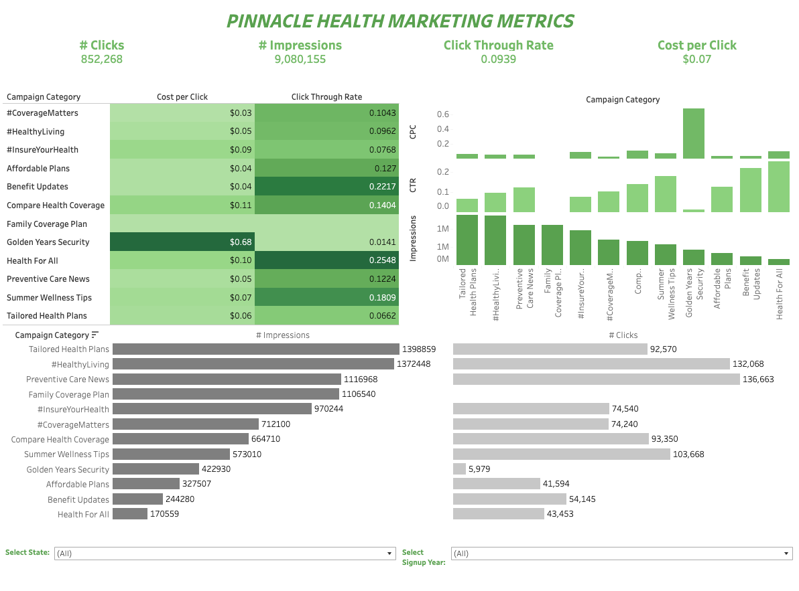
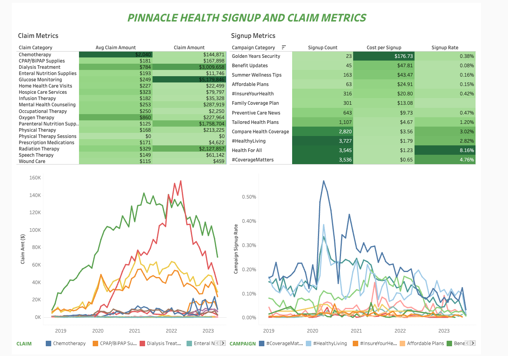

# Pinnacle Health Analysis

**_This project sets out to unravel the true impact of marketing campaigns at sample company Pinnacle Health Insurance. By diving deep into the performance metrics, Pinnacle Health will craft insightful, data-driven recommendations that will strategically guide future marketing budget allocations across diverse campaign categories._**

**Pinnacle Health's Story**: Pinnacle Health Insurance, established in 2016, provides medical insurance to thousands of customers across the United States. Since 2019, the company has launched innovative marketing campaigns focusing on health tips, affordability of plans, and preventative care. The company offers four distinct plans (bronze, silver, gold, platinum), each with varying premium rates and levels of claim coverage.

Pinnacle Health Insurance intends to evaluate the impact of their campaigns by analyzing North Star Metrics such as Click-Through Rate, Cost Per Click, impressions, and clicks. Through this analysis, Pinnacle Health aims to make informed, data-driven decisions regarding their marketing strategies. This process will enable the insurance company to pinpoint successful campaign elements, optimize budget allocation, fine-tune targeting strategies, and adjust offerings to better meet the needs of their customers. Ultimately, leveraging these insights enhances campaign effectiveness, boosts customer engagement, and fosters business growth for Pinnacle Health Insurance.
  
## Dashboard

Please find the complete Tableau Story [here](https://public.tableau.com/app/profile/z.w8482/viz/PinnacleHealthInsurance/SignupClaimDashboard). These dashboards allows users to examine trends and values regarding marketing, signup and claim metrics over time.

## Key Metrics

- **Signup Rate:** Percentage of users who complete the registration process after clicking through a landing page
- **Click Through Rate (CTR):** ratio of users who click on a specific link/advertisement to the number of total users who viewed that page
- **Cost per Click (CPC):** the amount an advertiser pays each time a user clicks on their advertisement
- **Click:** action taken by a user to select or activate a link, button or advertisement within an application
- **Impression:** indicator that an advertisement has been served as is visible to a user

## Overview Marketing Metrics

The campaign performance was strong, achieving an average click-through rate (CTR) of 10% and an average cost per click (CPC) of $0.07. This exceptional CTR indicates high engagement with the campaign content, while the low CPC reflects efficient use of the budget, ultimately contributing to a favorable return on investment and demonstrating the effectiveness of the campaign strategy.

**Certain campaigns show potential for improvement:**
- Golden Years Security Campaign had a CTR of only 1.41% with a high CPC of $.68
- Family Coverage Plan campaign received over 1.1 million impressions but did not generate any clicks.

**Successful campaigns include:**
- Health for All, which achieved a low CPC of $0.10 and a high CTR of 25%.
- The Benefit Updates campaign, which had a low CPC of $0.04 and an impressive CTR of 22.17%.

These insights highlight areas where adjustments can be made to optimize performance and capitalize on successful campaign strategies.

## Overview of Singup and Claim Metrics

By looking at Claim Dollar Amount over time, we see that Glucose Monitoring generated the most amount of claims. In July of 2021 it peaked with a total dollar amount of $142K. This amount subtly dipped with a total claim amount of 104K by May 2023.
The Dialysis Treatment claim amount sharply increased, ranging from 142K and 150K between March and July 2022. By May 2023 the amount dove deeply to $84K.

We see that the #Coverage Matters campaign generated the highest signup rate with a peek in April of 2020 at .6%.  Other notable campaigns that had max signup rates in April of 2020 as well were Health For All (.3%) and #HealthyLiving (.4%). From 2019-2023 these campaigns remained above .1% signup rate.
Campaigns that Pinnacle Health Insurance can alter and enhance to gain better awareness include Golden Years, Family Covered Care, and #InsureYourHealth. These campaigns had a asignup raight of under.1% between 2019 and 2023. 

## Recommendations and Actionable Steps

Based on the Pinnacle Health Analysis, several key strategies can enhance marketing campaign performance and optimize budget allocation:

**Optimize Underperforming Campaigns:**

- **Revise Messaging and Targeting:** Evaluate the effectiveness of messaging and targeting strategies for campaigns with low engagement. Implement A/B testing to determine more effective approaches.
- **Enhance Ad Content and Placement:** Reassess and improve the content and placement of ads that generate high impressions but low engagement. Strengthen calls-to-action to drive better user interaction.

**Leverage Successful Strategies:**

- **Analyze and Replicate Success:** Examine the elements of high-performing campaigns and apply similar strategies to other campaigns. Use insights from successful campaigns to enhance overall effectiveness and return on investment (ROI).

**Adjust Budget Allocation:**

- **Increase Investment in High-Performing Campaigns:** Allocate more resources to campaigns that demonstrate strong performance to maximize ROI.
Reduce Spend on Underperforming Campaigns: Reallocate budget from campaigns with poor performance until improvements are made.

**Monitor and Refine:** 

- **Track Key Metrics:** Continuously monitor metrics such as click-through rates, cost per click, and signup rates to refine strategies and ensure alignment with target audience needs.

- **Adapt Based on Trends:** Stay responsive to trends in signup rates and claims to adjust campaigns and strategies dynamically.

By implementing these general strategies, Pinnacle Health Insurance can enhance campaign effectiveness, optimize budget usage, and drive better overall results.

